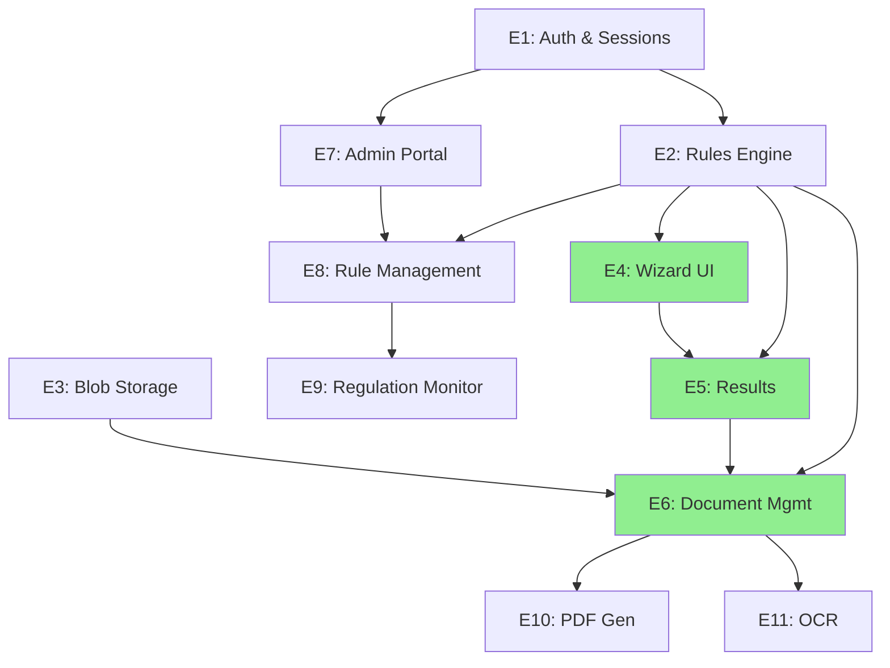

# MAA Feature Roadmap - Quick Reference

**Status**: MVP Planning Phase  
**Created**: 2026-02-08  
**Full Plan**: [IMPLEMENTATION_PLAN.md](./IMPLEMENTATION_PLAN.md)

---

## 🎯 Quick Navigation

**Choose your role**:

- 👨‍💼 [Product Manager](#product-manager-view)
- 👨‍💻 [Engineering Lead](#engineering-lead-view)
- 📊 [Project Manager](#project-manager-view)
- 🎨 [Designer](#designer-view)

---

## Product Manager View

### MVP Feature Set (Launch April 2026)

**What users can do**:

```
Landing Page (30 sec)
    ↓
State Selection (Auto-detect or manual)
    ↓
Eligibility Wizard (2-5 min, 15-30 questions)
    ↓
Eligibility Results (Program matching, confidence score, explanation)
    ↓
Document Checklist (Upload required docs)
    ↓
Ready to submit application (print checklist + results)
```

**What's NOT in MVP**:

- ❌ PDF application form generation
- ❌ Full 50-state coverage (only 5 pilots)
- ❌ Automatic regulation monitoring
- ❌ User login with resume capability
- ❌ Email notifications
- ❌ OCR document processing

### State Roadmap

```
Phase 2 (MVP):        Phase 3:           Phase 4+:
5 Pilot States        10 States          50 States + DC
├─ Illinois           ├─ Massachusetts   ├─ All remaining states
├─ California         ├─ Florida         └─ US Territories
├─ New York           ├─ Georgia
├─ Texas              ├─ Pennsylvania
└─ Arizona            └─ 5 others (TBD)
```

### Success Metrics

| Metric                      | MVP Target  | Measurement                    |
| --------------------------- | ----------- | ------------------------------ |
| **Wizard Completion Rate**  | ≥70%        | Users finishing without bounce |
| **Avg Time to Eligibility** | ≤5 minutes  | From start to results          |
| **Document Upload Rate**    | ≥50%        | Users uploading ≥1 doc         |
| **Mobile Traffic**          | ≥60%        | Responsive design success      |
| **Brand Attribution Lift**  | +25%        | AA awareness increase          |
| **Accessibility Score**     | WCAG 2.1 AA | Zero violations                |

---

## Engineering Lead View

### Critical Path Dependencies



### Phase 1: Foundation (6 weeks)

**Parallel workstreams**:

- **Backend**: Database schema, .NET API scaffold, dependency injection
- **DevOps**: Azure infrastructure, Blob Storage, Key Vault
- **Frontend**: React + Vite scaffold, TypeScript setup, component library

**Deliverables**:

- [ ] PostgreSQL schema (users, sessions, rules, documents, logs)
- [ ] .NET 10 API with clean architecture layers
- [ ] Authentication endpoints (JWT + sessions)
- [ ] React component scaffold with shadcn/ui + Tailwind
- [ ] CI/CD pipeline (GitHub Actions / Azure Pipelines)
- [ ] Rules engine core + 1 pilot state rules

**Key Success**: All tests passing; Constitution compliance gates in CI/CD

---

### Phase 2: MVP (8 weeks)

**Parallel workstreams**:

- **Frontend**: Wizard UI, Results page, Document upload UI
- **Backend**: Eligibility evaluation, document validation, results API
- **Rules**: Add rules for 4 more states; QA test coverage

**Deliverables**:

- [ ] Eligibility wizard (all question types, mobile-responsive, WCAG 2.1 AA)
- [ ] Wizard session API (save/restore/next-step endpoints)
- [ ] Eligibility results API + results page
- [ ] Document upload + checklist generation
- [ ] Alpha/Beta environment setup
- [ ] Rules for 5 pilot states + test cases
- [ ] Performance testing (p95 latencies meet targets)

**Key Success**: MVP launch with <5 minute user flow; 0 accessibility violations

---

### Phase 3: Admin & Compliance (6 weeks)

**Parallel workstreams**:

- **Backend**: Rule evaluation versioning, approval workflow, audit logging
- **Frontend**: Admin portal UI, rule editor, approval queue
- **Ops**: Automated backups, compliance monitoring

**Deliverables**:

- [ ] Admin portal with role-based access control
- [ ] Rule editor (structured form, JSON preview)
- [ ] Approval workflow (propose → review → activate)
- [ ] Version control for rules (effective dates, rollback)
- [ ] Rules for 5-10 additional states

**Key Success**: Admin can manage rules without engineering support

---

### Team Allocation (MVP Timeline)

```
Week 1-6 (Phase 1):
  Backend: 3-4 engineers (database, API, auth)
  Frontend: 2-3 engineers (scaffold, components)
  DevOps: 1 engineer (infrastructure)

Week 7-14 (Phase 2):
  Backend: 3 engineers (API endpoints, eligibility logic)
  Frontend: 2-3 engineers (wizard, results, document upload)
  Rules: 1 analyst (state rules authoring)
  QA: 1 engineer (testing, performance)

Week 15-20 (Phase 3):
  Backend: 2 engineers (admin APIs, approval workflow)
  Frontend: 1-2 engineers (admin UI)
  Rules: 1 analyst (rule management)
  DevOps: 1 engineer (monitoring, scaling)
```

---

## Project Manager View

### Timeline (Q1-Q2 2026)

```
┌─ January         ──┬─ February        ──┬─ March         ──┬─ April      ──┬─ May
│ Plan & Setup     │ Phase 1 Starts    │ Phase 1 Ends    │ MVP Launch │ Phase 3 Starts
│ Constitution     │ Foundation        │ Phase 2 Starts  │ 5 States   │ Admin Tools
│ Roadmap          │ E1, E2, E3        │ E4, E5, E6      │ Go-Live    │ Broader Coverage
└───────────────────┴───────────────────┴─────────────────┴─────────────┴───────────────

MVP Launch Blockers (Top 3 Risk Items):
1. Rules authoring takes longer than estimated → Solution: Pre-author rules in parallel
2. Performance (p95 > 2s) → Solution: Load testing early; cache FPL tables
3. Accessibility compliance → Solution: Weekly axe DevTools + screen reader testing
```

### Release Gates

**Phase 1 Done Gate** (End of Week 6):

- ✅ Auth endpoints working (session + JWT)
- ✅ Rules engine evaluates 1 state correctly
- ✅ CI/CD pipeline green (tests, lint, Constitution checks)
- ✅ Database schema finalized
- ✅ Frontend scaffold deployed

**Phase 2 Done Gate** (End of Week 14, MVP Launch):

- ✅ Wizard completion rate ≥70%
- ✅ All 5 pilot state rules QA passed
- ✅ Document upload working end-to-end
- ✅ Performance: p95 eligibility ≤2s
- ✅ WCAG 2.1 AA compliance verified
- ✅ Mobile-responsive tested on 5+ devices
- ✅ User testing shows results are clear/actionable

**Phase 3 Done Gate** (End of Week 20):

- ✅ Admin can create/edit rules without engineering
- ✅ Approval workflow enforced (no rule goes live without approval)
- ✅ 10 states live with auto-maintained rules
- ✅ Compliance audit trail complete

### Budget & Staffing

**MVP (Phases 1-2)**: 14 weeks, ~$300K engineering costs

- 3-4 Backend engineers @ $150K/year = ~$11K/week
- 2-3 Frontend engineers @ $130K/year = ~$8K/week
- 1 DevOps engineer @ $140K/year = ~2.5K/week
- 1 Rules analyst @ $80K/year = ~1.5K/week
- Tools/Infrastructure: ~$2K/week (Azure, services, licenses)
- **Total**: ~$268K over 14 weeks

**Phase 3+**: Steady-state

- Maintenance: 1-2 engineers
- Rules authoring: 1 analyst (per state)
- New features: 2-3 engineers (cycles)

### Stakeholder Communication

- **Weekly Status**: Engineering progress vs. roadmap; blockers raised early
- **Bi-weekly Demo**: Show working features (Alpha end of Phase 1, Beta end of Phase 2)
- **Monthly Executive**: User engagement metrics, brand lift, next phase funding

---

## Designer View

### Key UX Flows for MVP

#### 1. Landing Page

- Hero section: "Check your Medicaid eligibility in 5 minutes"
- 3 value props: "Free", "No application needed yet", "Understand your options"
- CTA: "Check Your Eligibility"
- Secondary: FAQs, disclaimers

#### 2. State Selection

- Map with state highlighting (if budget allows)
- "Enter your ZIP" with auto-detect toggle
- State name, brief info about state program differences
- Next: "Start Eligibility Quiz"

#### 3. Wizard Question Screens

- Progress bar (Question 5 of 18)
- Single question per screen
- Clear question text + "Why do we ask?" tooltip/collapsed section
- Answer input (varies by type: text, select, checkbox, date)
- Navigation: Back / Next (Back preserves answers)
- Mobile: Large touch targets, vertical scroll, no sideways navigation

#### 4. Results Page

- Status badge (Likely / Possibly / Unlikely Eligible)
- Program cards (descending likelihood):
  - Program name + icon
  - Eligibility status + confidence %
  - "Why you match" explanation
  - Next: "View Required Documents" link
- Alternative: "Browse other programs" (MAGI, SSI, other)
- Action: "Ready? Upload Documents to Continue"

#### 5. Document Checklist

- Required documents section (highlighted)
- Optional documents section
- For each: name, description, status (needed / uploaded / optional)
- Upload area: Drag-drop + file picker
- Progress: "3 of 5 required documents uploaded"
- Action: "Continue" or "Save & Resume" (Phase 5)

**Accessibility Requirements** (WCAG 2.1 AA):

- ✅ All text ≥16px (mobile), ≥14px (desktop)
- ✅ Color + icon/text for status (not color alone)
- ✅ Form labels explicit; no placeholder-only inputs
- ✅ Focus state visible; keyboard navigation complete
- ✅ Images have alt text; icons have aria-label
- ✅ Mobile: ≥44×44px touch targets; no hover-only interactions

**Design System**:

- shadcn/ui + Tailwind CSS (no custom component designs)
- Color palette:
  - Primary: Blue (CTAs, active states)
  - Success: Green (Eligible, uploaded)
  - Warning: Orange (Missing docs, questions)
  - Danger: Red (Errors, ineligible)
- Typography: Font stack TBD (recommend system fonts for performance)

### Figma Deliverables

**Phase 1**: High-fidelity mockups

- [ ] Landing page (desktop + mobile)
- [ ] State selection (desktop + mobile)
- [ ] 3 question types (text, select, date)
- [ ] Results page
- [ ] Document checklist

**Phase 2**: Component library

- [ ] Button variants (primary, secondary, danger, disabled)
- [ ] Form inputs (text, select, checkbox, radio, date)
- [ ] Cards (program card, document item)
- [ ] Modals (explanations, errors)
- [ ] Progress indicators (wizard + upload)

---

## 🚀 Quick Start for New Contributors

### I want to...

**...understand the full project scope**
→ Read [IMPLEMENTATION_PLAN.md](./IMPLEMENTATION_PLAN.md) (15 min)

**...spec a feature**
→ Run `/speckit.specify "feature description"`  
→ See: [.specify/templates/spec-template.md](../.specify/templates/spec-template.md)

**...understand Constitution principles**
→ Read [Constitution](./.specify/memory/constitution.md)  
→ Key: Code Quality, Test-First, UX Consistency, Performance SLOs

**...see what's blocked on what**
→ Check [Feature Dependencies](#critical-path-dependencies) section above

**...find tasks for Phase 1**
→ Phase 1 features: E1, E2, E3 in [IMPLEMENTATION_PLAN.md](./IMPLEMENTATION_PLAN.md#phase-1-foundation-weeks-1-6)

**...debug a failing test**
→ Constitution II (Test-First) requires tests BEFORE implementation  
→ Review test scenario in feature epic (e.g., E4: Eligibility Wizard UI)

---

## Checklist: Ready to Launch Phase 1?

- [ ] Team allocated (backend, frontend, devops engineers)
- [ ] AWS/Azure subscriptions set up
- [ ] GitHub repo initialized with branching strategy
- [ ] CI/CD pipeline configured (GitHub Actions / Azure Pipelines)
- [ ] Database migrations framework set up
- [ ] Constitution adopted by team
- [ ] Figma workspace shared with designers
- [ ] First 5 pilot states identified (IL, CA, NY, TX, FL recommended)
- [ ] Rules authoring tools/process defined
- [ ] Stakeholder kickoff scheduled

---

**Last Updated**: 2026-02-08  
**Status**: Ready for Phase 1 Kickoff  
**Next Review**: End of Week 6 (Phase 1 complete)
