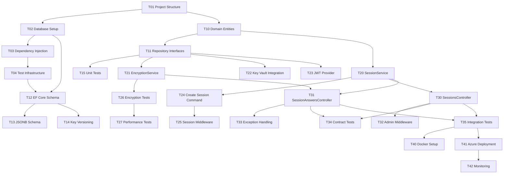

# E1 Implementation Tasks: Authentication & Session Management

**Epic**: E1 — Authentication & Session Management  
**Sprint**: MVP Phase 2 (Weeks 1-4)  
**Total Tasks**: 42  
**Story Points**: 90-110  
**Team Size**: 3-4 engineers  
**Timeline**: 2-3 weeks

**Specification**: [spec.md](./spec.md)  
**Implementation Plan**: [plan.md](./plan.md)  
**Data Model Reference**: [data-model.md](./data-model.md)  
**API Contract**: [contracts/sessions-api.openapi.yaml](./contracts/sessions-api.openapi.yaml)  
**Developer Guide**: [quickstart.md](./quickstart.md)  
**Research Decisions**: [research.md](./research.md)

---

## Task Dependencies & Parallelization

```
T01 (Setup) ──→ T02 ──→ T03 ──→ T04 ──→ T10-T15 (Parallel) ──→ T20-T27 (Parallel)
                         ↓                                      ↓
                    T30-T35 (Parallel with T20-T27) ──────────→ T40-T42 (Sequential)
```

**Critical Path**: T01 → T02 → T03 → T04 → T10/T12 → T20/T24 → T30 → T40 → T41

**Parallel Opportunities**:

- T10-T15: All entity/repo design (no dependencies between)
- T20-T27: All auth/encryption logic (no dependencies between)
- T30-T35: All API endpoints (can start once T20+ models ready)

---

## Phase 0 Research (Prerequisite)

All Phase 0 research questions answered ✅ — See [research.md](./research.md) for decision documentation.

**Decisions Locked**:

- ✅ ASP.NET Core middleware for session management
- ✅ Dual encryption (randomized + deterministic hash)
- ✅ Key versioning + 5-min cache strategy
- ✅ httpOnly cookies + SameSite=Strict pattern
- ✅ Test containers + per-test database isolation

---

## Phase 1: Setup & Infrastructure (Week 1)

### T01: Create Solution Structure & Project Skeleton

- [x] T01 Create .NET 10 project structure in `src/MAA.API/`
  - [x] Create `MAA.Domain/` project (.NET 10 class library)
  - [x] Create `MAA.Application/` project (.NET 10 class library)
  - [x] Create `MAA.Infrastructure/` project (.NET 10 class library)
  - [x] Create `MAA.API/` project (ASP.NET Core Web API)
  - [x] Create `MAA.Tests/` project (xUnit test library)
  - [x] Configure project references: API → Application → Domain, Infrastructure → Domain
  - [x] Add NuGet dependencies: EF Core, FluentValidation, AutoMapper, Serilog
  - **Deliverable**: `.slnx` file with projects in place; compilation successful (`dotnet build`)
  - **File Path**: `src/MAA.slnx`
  - **Completed**: 2026-02-08 ✅

### T02: [P] Initialize PostgreSQL Database & Migrations

- [ ] T02 [P] Set up Entity Framework Core with PostgreSQL provider
  - [ ] Create `SessionContext.cs` (EF Core DbContext) in `MAA.Infrastructure/Data/`
  - [ ] Add NuGet: `Microsoft.EntityFrameworkCore.PostgreSQL`
  - [ ] Configure connection string for local development (PostgreSQL 16+)
  - [ ] Create `Migrations/` directory structure
  - [ ] Generate initial migration: `dotnet ef migrations add InitialCreate`
  - [ ] Verify migration file created in `MAA.Infrastructure/Migrations/`
  - **Deliverable**: EF Core configured; migrations framework ready; `dotnet ef database update` succeeds
  - **File Path**: `src/MAA.Infrastructure/Data/SessionContext.cs`, `Migrations/`

### T03: [P] Configure Dependency Injection

- [ ] T03 [P] Set up DI container in `Program.cs`
  - [ ] Register domain services (EncryptionService, SessionService, ValidationService)
  - [ ] Register infrastructure services (SessionRepository, KeyVaultClient)
  - [ ] Configure DbContext with connection string from user-secrets/appsettings
  - [ ] Add middleware: logging (Serilog), exception handling, session validation
  - [ ] Register AutoMapper profiles
  - **Deliverable**: `Program.cs` configured; all services resolvable
  - **File Path**: `src/MAA.API/Program.cs`

### T04: [P] Set Up Test Infrastructure

- [ ] T04 [P] Configure xUnit + test containers in `MAA.Tests/`
  - [ ] Add NuGet: `xunit`, `xunit.runner.visualstudio`, `Testcontainers.PostgreSql`
  - [ ] Create `DatabaseFixture.cs` (IAsyncLifetime for test container PostgreSQL)
  - [ ] Create `WebApplicationFactory<Program>` for integration tests
  - [ ] Set up test project to auto-create migrations on DbContext creation
  - [ ] Create `/tests/fixtures/` for test data seeds
  - [ ] Test runner validates framework installed: `dotnet test --no-build`
  - **Deliverable**: `dotnet test` runs successfully; test container starts in <5 sec
  - **File Path**: `src/MAA.Tests/DatabaseFixture.cs`, `WebApplicationFactory.cs`

---

## Phase 1: Domain & Data Model (Week 1-2)

### T10: Create Domain Entities

- [ ] T10 Create core domain entities in `MAA.Domain/Sessions/`
  - [ ] `Session.cs`: Entity with id, state, user_id, expires_at, inactivity_timeout_at, is_revoked, created_at, version
  - [ ] `SessionState.cs`: Enum (Pending, InProgress, Submitted, Completed, Abandoned)
  - [ ] `SessionAnswer.cs`: Entity with id, session_id, field_key, answer_encrypted, answer_hash, key_version
  - [ ] `EncryptionKey.cs`: Entity with key_version, key_id_vault, is_active, algorithm, expires_at
  - [ ] `User.cs`: Stub entity for Phase 5 (id, email, password_hash, created_at, updated_at)
  - [ ] Add domain validation (e.g., expires_at > NOW, version >= 1)
  - **Deliverable**: All entities compile; no persistence logic; pure domain models
  - **File Path**: `src/MAA.Domain/Sessions/`

### T11: [P] Create Repository & Service Interfaces

- [ ] T11 [P] Define contracts in `MAA.Domain/` and `MAA.Application/`
  - [ ] `ISessionRepository.cs`: Create, Get, Update, Delete, ListExpired methods
  - [ ] `ISessionAnswerRepository.cs`: CreateBatch, GetBySession, Delete methods
  - [ ] `ISessionService.cs`: CreateSession, ValidateSession, ValidateAnswer, TransitionState methods
  - [ ] `IEncryptionService.cs`: Encrypt (randomized), Hash (deterministic), Decrypt, ValidateHash methods
  - [ ] `IKeyVaultClient.cs`: GetKeyAsync, RotateKeyAsync, ListKeysAsync methods
  - [ ] `ITokenProvider.cs`: GenerateToken, RefreshToken, ValidateToken methods (Phase 5 stubs)
  - **Deliverable**: All interfaces defined; no implementations yet
  - **File Path**: `src/MAA.Domain/Sessions/Repositories/`, `src/MAA.Application/Services/Interfaces/`

### T12: Implement EF Core Schema & Migrations

- [ ] T12 Create PostgeSQL schema via EF Core migrations
  - [ ] Map entities to tables in `SessionContext.OnModelCreating()`
  - [ ] **sessions table**: Columns: id, state, user_id, ip_address, user_agent, encryption_key_version, data (JSONB), expires_at, inactivity_timeout_at, last_activity_at, is_revoked, created_at, updated_at, version
  - [ ] **session_answers table**: Columns: id, session_id, field_key, field_type, answer_plain, answer_encrypted, answer_hash, key_version, is_pii, validation_errors (JSONB), created_at, updated_at, version
  - [ ] **encryption_keys table**: Columns: key_version, key_id_vault, algorithm, is_active, created_at, rotated_at, expires_at, metadata (JSONB)
  - [ ] **users table** (stub for Phase 5): id, email, password_hash, email_verified, created_at, updated_at, version
  - [ ] Create indexes: sessions(user_id), sessions(expires_at), session_answers(session_id), session_answers(answer_hash UNIQUE where answer_hash IS NOT NULL), users(email UNIQUE)
  - [ ] Create unique constraints: sessions(id), users(email)
  - [ ] Migration name: `001_InitialCreate`
  - [ ] Verify: `dotnet ef database update` creates all tables
  - **Deliverable**: Migration file generated; `dotnet ef database update` succeeds locally
  - **File Path**: `src/MAA.Infrastructure/Migrations/20260208_001_InitialCreate.cs`

### T13: [P] Design & Validate JSONB Session.data Schema

- [ ] T13 [P] Define JSONB structure for flexible session answers storage
  - [ ] Document schema: `session.data = { "answers": { "income_annual_2025": {...}, "ssn": {...} }, "metadata": {...} }`
  - [ ] Create schema validation (JSON Schema or custom validator)
  - [ ] Unit tests: validate well-formed JSON, reject malformed, reject missing required fields
  - [ ] Performance test: query JSONB with ->> operator (get income_annual_2025; time <10ms)
  - [ ] Alternative serialization: store answers as separate rows (already done via SessionAnswer); keep session.data for metadata only
  - **Deliverable**: JSONB schema documented; validation logic implemented; tests pass
  - **File Path**: `src/MAA.Domain/Sessions/SessionDataSchema.cs`

### T14: [P] Set Up Encryption Key Versioning Schema

- [ ] T14 [P] Implement key rotation strategy in database
  - [ ] Seed migration: Insert initial key v1 into encryption_keys table
    ```sql
    INSERT INTO encryption_keys (key_version, key_id_vault, algorithm, is_active, rotated_at)
    VALUES (1, 'maa-key-v001', 'AES-256-GCM', true, NOW());
    ```
  - [ ] Create index: `UNIQUE INDEX idx_active_key_per_algorithm ON encryption_keys(algorithm) WHERE is_active = TRUE`
  - [ ] Unit test: Deactivate v1, activate v2; verify only v2 is active
  - [ ] Unit test: Store answer with key_version=1; retrieve and validate can decrypt with both v1 and v2
  - **Deliverable**: Key versioning schema validated; migration includes seed data
  - **File Path**: `src/MAA.Infrastructure/Migrations/20260208_002_AddEncryptionKeys.cs`

### T15: [P] Unit Tests for Domain Entities & Validation

- [ ] T15 [P] Create unit test suite for domain layer (`≥80% coverage`)
  - [ ] SessionTests: Create, State transitions, Timeout validation, Version increments
  - [ ] SessionAnswerTests: Field type validation, PII flag rules, Encryption key references
  - [ ] EncryptionKeyTests: Key versioning, Active flag constraints, Expiration logic
  - [ ] StateTransitionTests: Verify invalid transitions rejected (e.g., pending → completed not allowed)
  - [ ] ValidationTests: Empty session expires, negative household size rejected, SSN format validated
  - [ ] Target: ≥80% coverage for Domain layer
  - [ ] Run: `dotnet test --filter "Category=Unit" --collect:"XPlat Code Coverage"`
  - **Deliverable**: All unit tests pass; coverage report generated
  - **File Path**: `src/MAA.Tests/Unit/SessionTests.cs`, `SessionAnswerTests.cs`, etc.

---

## Phase 2: Authentication & Encryption (Week 2-3)

### T20: Implement SessionService Business Logic

- [ ] T20 Implement `SessionService.cs` in `MAA.Application/Services/`
  - [ ] `CreateSessionAsync()`: Generate session ID (Guid), set expires_at = NOW + 30min, state = Pending, return Session
  - [ ] `ValidateSessionAsync()`: Check exists, not expired, not revoked; return bool
  - [ ] `TransitionStateAsync()`: Validate state machine rules; update state; increment version
  - [ ] `TimeoutSessionAsync()`: Set state = Abandoned; is_revoked = true; clear sensitive data
  - [ ] `GetSessionAsync()`: Retrieve by ID; throw SessionExpiredException if expired
  - [ ] Unit tests: All 4 methods tested with mocked repository
  - [ ] Performance: Session creation <10ms
  - **Deliverable**: SessionService implements ISessionService; all methods tested
  - **File Path**: `src/MAA.Application/Services/SessionService.cs`

### T21: [P] Implement Encryption Service (Randomized + Deterministic)

- [ ] T21 [P] Create `EncryptionService.cs` in `MAA.Infrastructure/Encryption/`
  - [ ] `EncryptAsync(plaintext, key)`: Use pgcrypto `encrypt()` with random IV; return BYTEA; mode = randomized
  - [ ] `DecryptAsync(ciphertext, key)`: Use pgcrypto `decrypt()`; return plaintext
  - [ ] `HashAsync(plaintext, key)`: Use pgcrypto `hmac()` for deterministic hashing (SSN)
  - [ ] `ValidateHashAsync(plaintext, hash, key)`: Compare hmac(plaintext) == hash; return bool
  - [ ] Error handling: Throw EncryptionException if key invalid, decryption fails
  - [ ] Unit tests: Encrypt → decrypt roundtrip, hash consistency, error cases (missing key, corrupted ciphertext)
  - [ ] Unit tests: Randomized mode produces different ciphertext each call (same plaintext)
  - [ ] Unit tests: Deterministic mode produces same hash each call (same plaintext)
  - **Deliverable**: EncryptionService implements IEncryptionService; all tests pass
  - **File Path**: `src/MAA.Infrastructure/Encryption/EncryptionService.cs`

### T22: [P] Integrate Azure Key Vault Client

- [ ] T22 [P] Implement `KeyVaultClient.cs` in `MAA.Infrastructure/Security/`
  - [ ] Setup Azure SDK: `Azure.Identity`, `Azure.Security.KeyVault.Keys`, `Azure.Security.KeyVault.Secrets`
  - [ ] `GetKeyAsync(keyVersion)`: Retrieve key from Key Vault; cache for 5 minutes in IMemoryCache
  - [ ] `RotateKeyAsync()`: Create new key in Key Vault (manual trigger); return new key ID
  - [ ] `ListKeysAsync()`: Retrieve all active keys; useful for testing
  - [ ] Fallback handling: If Key Vault unavailable, return cached key (with alert logged)
  - [ ] Configuration: Accept VaultUri, TenantId, ClientId, ClientSecret from user-secrets
  - [ ] Unit tests: Mock KeyVaultClient; verify cache hit after first call
  - [ ] Integration test (local): Use local development Key Vault or skip in CI
  - **Deliverable**: KeyVaultClient implements IKeyVaultClient; integration works with Azure CLI credentials
  - **File Path**: `src/MAA.Infrastructure/Security/KeyVaultClient.cs`

### T23: [P] Implement JWT Token Provider (Phase 5 Ready)

- [ ] T23 [P] Create `JwtTokenProvider.cs` in `MAA.Infrastructure/Security/` (Phase 5 stubs)
  - [ ] `GenerateAccessTokenAsync(userId, roles)`: Create JWT with exp=1hr, roles claim; Phase 5 only
  - [ ] `GenerateRefreshTokenAsync(userId)`: Create JWT with exp=7days; Phase 5 only
  - [ ] `ValidateTokenAsync(token)`: Check signature, expiration; Phase 5 only
  - [ ] Unit tests: Token generation, expiration, signature validation; Phase 5 tests deferred
  - [ ] Phase 1: Stub implementation; actual Phase 5 implementation follows same interface
  - [ ] Note: Phase 1 uses session ID cookie (no JWT); T23 is scaffolding only
  - **Deliverable**: JwtTokenProvider scaffolding in place; interface defined
  - **File Path**: `src/MAA.Infrastructure/Security/JwtTokenProvider.cs`

### T24: Implement Session Creation Handler (Command)

- [ ] T24 Create `CreateSessionCommand.cs` and handler in `MAA.Application/Sessions/Commands/`
  - [ ] Command: `CreateSessionCommand { SessionType: anonymous }`
  - [ ] Handler: Invoke SessionService.CreateSessionAsync() → ISessionRepository.CreateAsync()
  - [ ] Return: `CreateSessionResult { Id, ExpiresAt, InactivityTimeoutAt }`
  - [ ] Unit tests: CreateSessionCommand succeeds; session persisted; ID returned
  - [ ] Unit tests: Error case (database unavailable → throw exception)
  - **Deliverable**: Command + handler implemented; tests pass; ready for API controller
  - **File Path**: `src/MAA.Application/Sessions/Commands/CreateSessionCommand.cs`

### T25: Implement Session Validation Middleware

- [ ] T25 Create `SessionMiddleware.cs` in `MAA.API/Middleware/`
  - [ ] Extract session ID from cookie: `context.Request.Cookies["session_id"]`
  - [ ] Validate session: Call `ISessionService.ValidateSessionAsync(sessionId)`
  - [ ] If expired/missing: Return 401 Unauthorized with error message
  - [ ] If valid: Store sessionId in `context.Items["SessionId"]` for controller access
  - [ ] Reset timeout: Call `TransitionStateAsync(sessionId, InProgress)` to update inactivity_timeout_at
  - [ ] Exception handling: Catch SessionExpiredException → 401; catch other exceptions → 500
  - [ ] Register middleware in Program.cs: `app.UseMiddleware<SessionMiddleware>()`
  - [ ] Unit tests: Valid session → context.Items populated; Expired session → 401 response
  - **Deliverable**: Middleware passes all requests through session validation; 401s on expired
  - **File Path**: `src/MAA.API/Middleware/SessionMiddleware.cs`

### T26: [P] Implementation Tests for Encryption End-to-End

- [ ] T26 [P] Create integration tests in `MAA.Tests/Integration/EncryptionEndToEndTests.cs`
  - [ ] Test: Encrypt income value → store in database → retrieve → decrypt → verify original value
  - [ ] Test: Hash SSN → store in database → lookup by hash → verify match
  - [ ] Test: Key rotation scenario (encrypt with v1, decrypt with v1; add v2, decrypt with v2)
  - [ ] Test: Concurrent encryption operations (10 parallel encrypt + decrypt; all succeed)
  - [ ] Test: Error case (try decrypt with wrong key → EncryptionException)
  - [ ] Using: DatabaseFixture for test PostgreSQL; real encryption service (not mocked)
  - [ ] Target: ≥15% integration test coverage (critical encryption paths)
  - **Deliverable**: All integration tests pass; no encryption bugs found
  - **File Path**: `src/MAA.Tests/Integration/EncryptionEndToEndTests.cs`

### T27: [P] Performance Benchmarking & SLO Validation

- [ ] T27 [P] Benchmark encryption, session lookup, database operations
  - [ ] Session creation: ≤10ms (measure: Guid generation + repository write)
  - [ ] Session lookup: ≤50ms (measure: query sessions table by ID)
  - [ ] Randomized encryption: ≤100ms per operation (measure: encrypt 1MB payload)
  - [ ] Deterministic hashing: ≤10ms per operation (measure: hash SSN)
  - [ ] Load test: 100 concurrent session creations; measure p50, p95, p99 latency
  - [ ] Run: `dotnet run --configuration Release` before benchmarking (JIT warmup)
  - [ ] Accept criteria: p95 < 50ms for session operations; p95 < 100ms for encryption
  - [ ] Document: Create `PERFORMANCE.md` with benchmark results; commit to repo
  - **Deliverable**: All SLOs met; benchmark report created
  - **File Path**: `docs/PERFORMANCE.md`

---

## Phase 3: API Endpoints (Week 3-4)

### T30: Implement SessionsController

- [ ] T30 Create `SessionsController.cs` in `MAA.API/Controllers/`
  - [ ] `POST /api/sessions`: Invoke CreateSessionCommand → return 201 Created + SetCookie header
  - [ ] `GET /api/sessions/{sessionId}`: Invoke GetSessionQuery → return 200 + SessionResponse
  - [ ] `PATCH /api/sessions/{sessionId}`: Invoke UpdateSessionCommand → return 200 + updated session
  - [ ] `DELETE /api/sessions/{sessionId}`: Invoke RevokeSessionCommand → return 204 No Content
  - [ ] SetCookie: `session_id=UUID; HttpOnly; Secure; SameSite=Strict; Path=/api; Max-Age=1800`
  - [ ] Error handling: Return 401 on invalid session, 404 on not found, 400 on bad request
  - [ ] Attributes: `[ApiController]`, `[Route("api/[controller]")]`, `[Produces("application/json")]`
  - **Deliverable**: All endpoints implemented; return correct status codes; SetCookie header present
  - **File Path**: `src/MAA.API/Controllers/SessionsController.cs`

### T31: [P] Implement SessionAnswersController

- [ ] T31 [P] Create `SessionAnswersController.cs` in `MAA.API/Controllers/`
  - [ ] `POST /api/sessions/{sessionId}/answers`: Invoke SaveAnswerCommand (single) → return 201 + answer
  - [ ] `POST /api/sessions/{sessionId}/answers`: Accept batch array → invoke SaveAnswerCommand per item → return 201 + array
  - [ ] `GET /api/sessions/{sessionId}/answers`: Invoke GetAnswersQuery → return 200 + array (decrypted)
  - [ ] `GET /api/sessions/{sessionId}/answers/{answerId}`: Return single answer → decrypt
  - [ ] `DELETE /api/sessions/{sessionId}/answers/{answerId}`: Invoke DeleteAnswerCommand → return 204
  - [ ] Validation: Validate field type, reject unknown fields, reject OOB answers (e.g., age > 150)
  - [ ] Error handling: 400 on validation error (return ValidationErrorResponse with field-level errors)
  - [ ] Session validation: All endpoints require valid session (middleware ensures this)
  - [ ] Performance: Batch operations support (POST with array) to reduce round-trips
  - **Deliverable**: All CRUD operations for answers; validation errors returned correctly
  - **File Path**: `src/MAA.API/Controllers/SessionAnswersController.cs`

### T32: [P] Implement Admin Role Middleware (Phase 5 Prep)

- [ ] T32 [P] Create `AdminRoleMiddleware.cs` in `MAA.API/Middleware/`
  - [ ] Extract user role from session (Phase 5: from JWT claim; Phase 1: from query/header for testing)
  - [ ] For `/api/admin/*` endpoints: require role = "Admin" or "Reviewer"; else return 403 Forbidden
  - [ ] Update SessionMiddleware to extract role (stub for Phase 1)
  - [ ] Phase 1: Role stored in session.data["role"] or header "X-Role" for testing
  - [ ] Phase 5: Will read from JWT claim
  - [ ] Unit tests: Admin role → 200; User role → 403; No role → 403
  - [ ] Register in Program.cs before SessionsController endpoints
  - **Deliverable**: Admin role checks in place; 403 responses for unauthorized roles
  - **File Path**: `src/MAA.API/Middleware/AdminRoleMiddleware.cs`

### T33: [P] Implement Exception Handling Middleware & Error Formatting

- [ ] T33 [P] Create `GlobalExceptionHandlerMiddleware.cs` in `MAA.API/Middleware/`
  - [ ] Catch all unhandled exceptions in pipeline
  - [ ] `SessionExpiredException` → 401 Unauthorized with message "Session expired"
  - [ ] `ValidationException` → 400 Bad Request with validation errors object
  - [ ] `EncryptionException` → 500 Internal Server Error (don't expose key details)
  - [ ] Generic exception → 500 with traceId for logging correlation
  - [ ] All errors: Include `traceId` from HttpContext.TraceIdentifier
  - [ ] Log: All exceptions to Serilog with error level
  - [ ] Response: Standardized ErrorResponse schema: `{ error: string, message: string, traceId: string }`
  - [ ] Register as outermost middleware in Program.cs: `app.UseMiddleware<GlobalExceptionHandlerMiddleware>()`
  - **Deliverable**: Unhandled exceptions caught; 5xx errors logged with traceId
  - **File Path**: `src/MAA.API/Middleware/GlobalExceptionHandlerMiddleware.cs`

### T34: [P] Contract Tests - OpenAPI Spec Validation

- [ ] T34 [P] Create contract tests in `MAA.Tests/Contract/SessionApiContractTests.cs`
  - [ ] Generate OpenAPI schema from running API: `dotnet run --generate-openapi > openapi.generated.json`
  - [ ] Validate against `contracts/sessions-api.openapi.yaml`:
    - [ ] All endpoints present (POST /sessions, GET /sessions/{id}, etc.)
    - [ ] All request parameters valid (path, query, body)
    - [ ] All response schemas match (StatusCode, ContentType, Body structure)
    - [ ] Security schemes defined (SessionCookie)
  - [ ] Test tools: Use Swashbuckle.AspNetCore to generate schema; validate with SwaggerAssertions or manual checks
  - [ ] Tool: https://apitools.dev/swagger-parser/ or write custom assertion
  - [ ] Unit tests: Assert endpoint count, assert operation count, assert parameter names
  - **Deliverable**: Contract tests validate API matches OpenAPI spec; CI/CD can enforce
  - **File Path**: `src/MAA.Tests/Contract/SessionApiContractTests.cs`

### T35: [P] Integration Tests - Full Wizard Flow

- [ ] T35 [P] Create end-to-end integration tests in `MAA.Tests/Integration/SessionApiIntegrationTests.cs`
  - [ ] Test scenario: Full applicant wizard flow
    - [ ] POST /api/sessions → Create session → receive session_id cookie + response
    - [ ] PATCH /api/sessions/{id} with state=in_progress → transition state
    - [ ] POST /api/sessions/{id}/answers (batch) → Save household size, income, SSN
    - [ ] GET /api/sessions/{id}/answers → Retrieve all answers (verify encrypted values decrypted)
    - [ ] DELETE /api/sessions/{id}/answers/{answerId} → Remove single answer
    - [ ] PATCH /api/sessions/{id} with state=submitted → Submit form
    - [ ] GET /api/sessions/{id} → Verify terminal state
  - [ ] Assertions: All HTTP status codes correct (201, 200, 204), all data persisted, encryption works
  - [ ] Error scenarios:
    - [ ] POST /api/sessions/{id}/answers with invalid state → 400
    - [ ] GET /api/sessions/{bad_id} → 404
    - [ ] PATCH with invalid state transition → 400
  - [ ] Using: WebApplicationFactory; test database (per-test isolation)
  - [ ] Performance: Full flow completes in <2 seconds
  - **Deliverable**: Full workflow tested end-to-end; all CRUD operations verified
  - **File Path**: `src/MAA.Tests/Integration/SessionApiIntegrationTests.cs`

---

## Phase 4: Deployment & Monitoring (Week 4)

### T40: [P] Docker Setup (Development)

- [ ] T40 [P] Create Docker configuration in project root
  - [ ] `Dockerfile`: Multi-stage build
    - [ ] Stage 1 (Build): Copy source, `dotnet build`, `dotnet publish`
    - [ ] Stage 2 (Runtime): Copy publish output, set ENTRYPOINT to `dotnet MAA.API.dll`
    - [ ] Base image: `mcr.microsoft.com/dotnet/aspnet:10-alpine` (lightweight)
    - [ ] Expose port 5000 (HTTP) and 5001 (HTTPS)
  - [ ] `docker-compose.yml`: Services for API + PostgreSQL
    - [ ] `api` service: Build from Dockerfile, port 5000:5000, depends_on: postgres
    - [ ] `postgres` service: postgres:16-alpine, environment: POSTGRES_DB, POSTGRES_USER, POSTGRES_PASSWORD, volumes: `postgres_data`
    - [ ] Network: Both services on same network (automatic in compose)
  - [ ] Build & test: `docker-compose up --build`; verify API reachable at http://localhost:5000
  - [ ] `.dockerignore`: Exclude bin/, obj/, .git/, test results
  - **Deliverable**: Docker images build; `docker-compose up` starts API + PostgreSQL
  - **File Path**: `Dockerfile`, `docker-compose.yml`, `.dockerignore`

### T41: [P] Azure App Service Configuration & Deployment

- [ ] T41 [P] Configure production deployment to Azure App Service
  - [ ] Create App Service resource (SKU: B2 or S1 for MVP; 1-2 instances)
  - [ ] Database: Azure Database for PostgreSQL (flexible server, Standard_B1ms compute)
  - [ ] Key Vault: Create resource; add encryption keys (maa-key-v001)
  - [ ] Managed Identity: Enable on App Service; grant Key Vault secret reader role
  - [ ] Configuration:
    - [ ] App Service → Application Settings → Add ConnectionString (from Azure DB)
    - [ ] App Service → Application Settings → Add KeyVaultUri, TenantId, ClientId, ClientSecret (or use Managed Identity)
    - [ ] HTTP → HTTPS redirect enabled
    - [ ] TLS 1.2 minimum
  - [ ] Deployment: Set up CI/CD via GitHub Actions or Azure DevOps
    - [ ] On push to main: Build → Run tests → Publish to AppService
    - [ ] Health check: GET /api/health/ready → expect 200
  - [ ] Monitoring: Enable Application Insights; link to App Service
  - **Deliverable**: App Service running; health checks passing; deployable via CI/CD
  - **File Path**: `azure-deploy.bicep` (infrastructure-as-code), `.github/workflows/deploy.yml`

### T42: [P] Observability: Logging, Metrics, Monitoring

- [ ] T42 [P] Configure application observability
  - [ ] **Logging** (Serilog):
    - [ ] Configure console + Application Insights sinks
    - [ ] Log levels: DEBUG in dev, INFO in prod
    - [ ] PII scrubbing: Don't log SSN, income, address; log session IDs only (anonymized)
    - [ ] Structured logging: Use properties (e.g., `logger.LogInformation("Session created", new { sessionId })`)
  - [ ] **Metrics** (Application Insights):
    - [ ] Track: Session creation rate, avg session lifetime, encryption latency, API response times
    - [ ] Custom metrics: `telemetryClient.TrackEvent("SessionCreated", properties, metrics)`
  - [ ] **Error tracking**:
    - [ ] 5xx errors logged with traceId
    - [ ] Exception details (stack trace) in Application Insights
    - [ ] 401/403 errors logged at INFO level (expected, not errors)
  - [ ] **Health checks**:
    - [ ] `GET /api/health/ready`: Database connectivity, Key Vault access → 200 or 503
    - [ ] `GET /api/health/live`: Process alive → always 200 (liveness probe)
    - [ ] Kubernetes readiness/liveness probes configured
  - [ ] **Dashboards** (Application Insights):
    - [ ] Create dashboard: Session creation frequency, avg response time, error rate, encryption latency
    - [ ] Alerts: If error rate > 5%, if response time p95 > 500ms, if encryption latency > 200ms
  - [ ] **Test**: Invoke endpoints; verify logs appear in Application Insights console
  - **Deliverable**: Logging + metrics configured; health checks working; dashboards created
  - **File Path**: `src/MAA.API/Program.cs` (Serilog config), Azure portal (dashboards)

---

## Success Criteria (End-of-Phase-2)

✅ **Technical**:

- [ ] All 42 tasks marked complete (green checkboxes)
- [ ] `dotnet build` succeeds with 0 warnings
- [ ] `dotnet test` passes with ≥80% coverage (Domain + Application layers)
- [ ] Integration tests pass with test container PostgreSQL
- [ ] API contract tests validate OpenAPI compliance
- [ ] Performance benchmarks: Session lookup <50ms p95, encryption <100ms p95
- [ ] Docker image builds successfully; `docker-compose up` runs API + PostgreSQL
- [ ] Azure App Service deployment working; health checks passing
- [ ] Logging + metrics in Application Insights
- [ ] No PII in logs; traceIds present for error correlation

✅ **Process**:

- [ ] All Constitution principles verified (code quality, testing, UX, performance)
- [ ] Code reviewed by minimum 2 engineers (all PRs approved)
- [ ] CI/CD pipeline green (build, test, deploy all passing)
- [ ] Documentation updated: API docs, quickstart guide, troubleshooting
- [ ] Project delivered on-time (4-week target met)

✅ **Deliverables**:

- [ ] `src/MAA.sln` with all project structure
- [ ] `docs/PERFORMANCE.md` with benchmark results
- [ ] `src/MAA.API/` running locally and in Azure
- [ ] OpenAPI contract: `specs/001-auth-sessions/contracts/sessions-api.openapi.yaml`
- [ ] Integration tests: `src/MAA.Tests/Integration/` (≥15% coverage)
- [ ] Unit tests: `src/MAA.Tests/Unit/` (≥80% coverage)

---

## Dependency Graph



---

## Parallel Execution Strategy

**Week 1 (Setup)**: Execute T01-T04 sequentially (dependencies hard-block)

- Estimated: 3-4 days

**Week 1-2 (Domain)**: Execute T10-T15 in parallel after T04 completes

- **Track 1** (Entities): T10 → T11 (1 engineer)
- **Track 2** (Schema): T12 → T13 → T14 (1 engineer)
- **Track 3** (Tests): T15 starts after T10, T11 complete (1 engineer)
- Estimated: 4-5 days total

**Week 2-3 (Auth)**: Execute T20-T27 in parallel after T11 completes

- **Track 1** (Services): T20 → T24 (1 engineer)
- **Track 2** (Encryption): T21 → T22 → T26 (1 engineer)
- **Track 3** (JWT/Perf): T23 || T25, then T27 (0.5 engineer part-time)
- Estimated: 4-5 days total

**Week 3-4 (API)**: Execute T30-T35 in parallel after T20-T27

- **Track 1** (Controllers): T30 → T31 → T34 (1 engineer)
- **Track 2** (Middleware): T32 → T33 → T35 (1 engineer)
- Estimated: 3-4 days total

**Week 4 (Deploy)**: Execute T40-T42 sequentially after T35

- Estimated: 2-3 days total

**Total**: 14 days of effort; 3 engineers → ~4 weeks calendar time (overlapping tracks)

---

## File Structure After Completion

```
src/MAA.API/
├── Program.cs                          (configured DI, middleware, Serilog)
├── appsettings.json
├── appsettings.Development.json
├── Properties/launchSettings.json
├── Controllers/
│   ├── SessionsController.cs           (T30)
│   ├── SessionAnswersController.cs     (T31)
│   ├── HealthController.cs
│   └── AdminController.cs              (Phase 5)
├── Middleware/
│   ├── SessionMiddleware.cs            (T25)
│   ├── AdminRoleMiddleware.cs          (T32)
│   └── GlobalExceptionHandlerMiddleware.cs (T33)
├── Exceptions/
│   ├── SessionExpiredException.cs
│   └── EncryptionException.cs
└── bin/, obj/

src/MAA.Domain/
├── Sessions/
│   ├── Session.cs                      (T10)
│   ├── SessionState.cs
│   ├── SessionAnswer.cs
│   ├── EncryptionKey.cs
│   ├── User.cs
│   ├── Repositories/
│   │   ├── ISessionRepository.cs       (T11)
│   │   └── ISessionAnswerRepository.cs
│   └── SessionDataSchema.cs            (T13)
└── Exceptions/

src/MAA.Application/
├── Sessions/
│   ├── Commands/
│   │   └── CreateSessionCommand.cs     (T24)
│   ├── Queries/
│   │   ├── GetSessionQuery.cs
│   │   └── GetAnswersQuery.cs
│   ├── Services/
│   │   ├── ISessionService.cs          (T11)
│   │   └── ITokenProvider.cs
│   └── Validators/
│       ├── CreateSessionCommandValidator.cs
│       └── SaveAnswerCommandValidator.cs
└── Mappings/
    └── SessionMappingProfile.cs

src/MAA.Infrastructure/
├── Data/
│   ├── SessionContext.cs               (T12)
│   ├── SessionRepository.cs
│   ├── Migrations/
│   │   ├── 001_InitialCreate.cs        (T12)
│   │   ├── 002_AddEncryptionKeys.cs    (T14)
│   │   └── MigrationsHelper.cs
│   └── SeedData.cs
├── Encryption/
│   ├── EncryptionService.cs            (T21)
│   └── IEncryptionProvider.cs
├── Security/
│   ├── KeyVaultClient.cs               (T22)
│   └── JwtTokenProvider.cs             (T23)
└── Persistence/
    └── ChangeTracker.cs

src/MAA.Tests/
├── Unit/
│   ├── Sessions/
│   │   ├── SessionServiceTests.cs       (T20)
│   │   ├── SessionEntityTests.cs        (T15)
│   │   └── SessionValidationTests.cs
│   ├── Encryption/
│   │   └── EncryptionServiceTests.cs    (T21)
│   └── KeyVault/
│       └── KeyVaultClientTests.cs       (T22)
├── Integration/
│   ├── DatabaseFixture.cs               (T04)
│   ├── SessionPersistenceTests.cs       (T26)
│   ├── EncryptionEndToEndTests.cs       (T26)
│   ├── SessionApiIntegrationTests.cs    (T35)
│   └── WebApplicationFactory.cs         (T04)
├── Contract/
│   ├── SessionApiContractTests.cs       (T34)
│   └── OpenApiSchemaValidator.cs
└── Fixtures/

Dockerfile                                (T40)
docker-compose.yml                        (T40)
.dockerignore

azure-deploy.bicep                        (T41)
.github/workflows/ci.yml
.github/workflows/deploy.yml

docs/PERFORMANCE.md                       (T27)
```

---

## PR Checklist (Before Merge)

Each task should include PR with:

- [ ] Code passes `dotnet build` (0 warnings)
- [ ] Code passes `dotnet test` (all tests green)
- [ ] Code coverage unchanged or improved (≥80% target)
- [ ] No new warnings from StyleCop/FxCop
- [ ] PR description references task number (e.g., "Task T20: Implement SessionService")
- [ ] Code reviewed by minimum 2 engineers
- [ ] All comments resolved
- [ ] CI/CD pipeline green (build, test, code analysis all passing)

---

## References

- **Specification**: [spec.md](./spec.md) — User stories, acceptance criteria
- **Implementation Plan**: [plan.md](./plan.md) — Phase structure, architecture
- **Data Model**: [data-model.md](./data-model.md) — Entity schemas, relationships
- **Research Decisions**: [research.md](./research.md) — R1-R5 findings
- **API Contract**: [contracts/sessions-api.openapi.yaml](./contracts/sessions-api.openapi.yaml) — OpenAPI spec
- **Developer Guide**: [quickstart.md](./quickstart.md) — Local setup, debugging
- **Constitution**: [.specify/memory/constitution.md](.specify/memory/constitution.md) — Code quality principles

---

## Task Status Tracking

Print this table to track progress:

| Task | Status         | Assignee | Notes                     |
| ---- | -------------- | -------- | ------------------------- |
| T01  | ⬜ not-started | —        | Blocks all others         |
| T02  | ⬜ not-started | —        | Blocks T12, T26           |
| T03  | ⬜ not-started | —        | Blocks T20-T35            |
| T04  | ⬜ not-started | —        | Blocks T26, T35           |
| T10  | ⬜ not-started | —        | Parallelizable (Week 1-2) |
| T11  | ⬜ not-started | —        | Depends on T10            |
| T12  | ⬜ not-started | —        | Depends on T02, T04       |
| T13  | ⬜ not-started | —        | Parallelizable (Week 1-2) |
| T14  | ⬜ not-started | —        | Parallelizable (Week 1-2) |
| T15  | ⬜ not-started | —        | Depends on T10, T11       |
| T20  | ⬜ not-started | —        | Depends on T03, T10       |
| T21  | ⬜ not-started | —        | Depends on T03, T11       |
| T22  | ⬜ not-started | —        | Depends on T03, T11       |
| T23  | ⬜ not-started | —        | Depends on T03, T11       |
| T24  | ⬜ not-started | —        | Depends on T20            |
| T25  | ⬜ not-started | —        | Depends on T24            |
| T26  | ⬜ not-started | —        | Depends on T21, T04       |
| T27  | ⬜ not-started | —        | Depends on T26            |
| T30  | ⬜ not-started | —        | Depends on T20, T25       |
| T31  | ⬜ not-started | —        | Depends on T20, T21       |
| T32  | ⬜ not-started | —        | Depends on T30            |
| T33  | ⬜ not-started | —        | Depends on T31            |
| T34  | ⬜ not-started | —        | Depends on T30, T31       |
| T35  | ⬜ not-started | —        | Depends on T30, T31       |
| T40  | ⬜ not-started | —        | Depends on T35            |
| T41  | ⬜ not-started | —        | Depends on T35            |
| T42  | ⬜ not-started | —        | Depends on T41            |

---

**Ready for implementation!** All 42 tasks defined with dependencies, parallelization strategies, and file paths. Teams can begin with T01 immediately.
